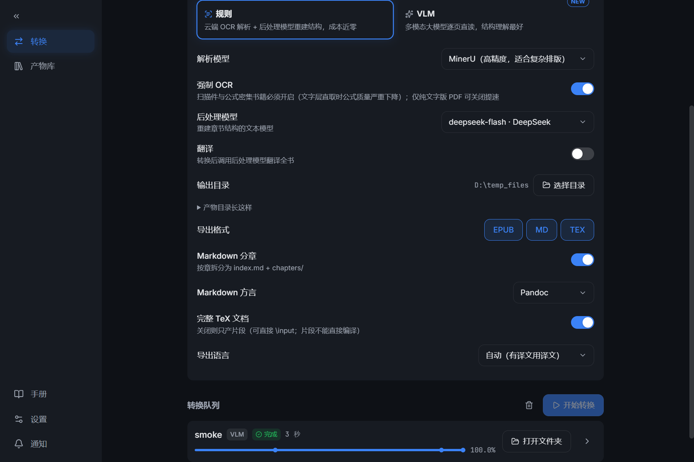

# Books_Converter · 扫描书一键成册

[](LICENSE)
[](https://www.python.org/)
[](https://github.com/Feplus2/Books_Converter/releases)

扫描版/文字版 PDF 一键转成**真正的电子书**：多级目录树、可点击脚注、
MathML 公式、跨页断段拼接——还可以顺手**翻译成中文**。全部走云端 API，
本地无需 GPU。

```
PDF → Stage 1 解析引擎（MinerU 云 / PaddleOCR-VL 云 / VLM 逐页视觉直读）
    → Stage 2 结构重建（标题层级 / 跨页拼接 / 跨页表格 / 图注归属 / 脚注配对）
    → Stage 3 装订导出（EPUB + Markdown + TeX，三格式同构）
    → Stage 4 可选：全书翻译（DeepSeek 分批 + 滚动译名表，any to any）
```

> 本项目的复杂度不在引擎也不在 EPUB 打包，而在 **Stage 2 的结构重建语义**：
> 目录条目是绝对的结构真值，正文标题是噪声候选，两者之间由一套
> 「锚点匹配 + 形状栈 + 救援/下沉/查重/否决」的规则系桥接
> （见 [wiki/02](wiki/02-structure-system.md)）。每条守卫的失败方向都是
> 「宁可不做，也不错做」。

## 界面

Tauri 2 + React 桌面 GUI（旧 tkinter GUI 冻结维护中，见[界面关系](#界面关系)）：




## 三引擎

| 引擎 | 形态 | 定位 | 费用 |
|---|---|---|---|
| **MinerU** | 云端 OCR + 版面分析 API | 规则族主力：表格密集书最强（跨页表合并、rowspan 修正） | 免费 1000 页/日 |
| **PaddleOCR-VL** | 云端整页识别 API | 规则族备选：速度快、图注绑定准、每日额度高 | 免费 3000 页/天 |
| **VLM** | 多模态大模型逐页直读（`stage1_vlm`：GLM 转写 + 脚注重建 + 同模型图片粗框 + 光栅重裁 + SQLite 断点续跑 + 目录先验） | 结构理解最好：脚注配对/版式语义是一等公民；配专用薄编排 Stage 2（`stage2_vlm`，不再让文本模型重打标视觉模型的判断） | GLM-4.6V-Flash 免费；GLM-5.3-Flash 约 3 元/本（400 页） |

三引擎 Stage 1 产出同一套 MinerU 风格 `content_list` 契约（0–1000 千分位
bbox），下游可选共用；但 Stage 2 分两个编排器——规则引擎走
`stage2_hybrid`（它处理的就是烂输入，救援规则全在这边），VLM 走
`stage2_vlm`（薄编排，信任优先 + 校验导向，目录先验直接作锚）。
引擎缓存**按引擎名键控**（`<work_dir>/<engine>/`），同书换引擎 A/B 对照
互不踩（FIXLOG 047 对照实验即依赖这点）。

## 产物

一次转换可多选产出三格式（`--format epub,md,tex`），目录契约（病例 049 起）：

```
<输出目录>/<书名>/
├── epub/<书名>.epub   电子书成品（嵌套目录 / MathML / 可点击尾注 / 封面）
├── md/                Markdown（单文件或 index.md + chapters/ 分章，GFM/Pandoc）
├── tex/               TeX + images/（完整文档：xelatex 直接编译，首行
│                      % !TeX program = xelatex 防呆；片段：头部注释明示
│                      「不能直接编译」）
├── mineru/ vlm/ …     Stage 1 引擎缓存（重跑提速，可整个删）
└── structure.json / popo_blocks.json / translations.json
```

三格式全部交付成功后，管线自动清理根级中间产物（与交付副本字节相同的
重复文件）；任一格式失败则不清理（失败方向 = 不动作）。

## 功能特性

- **结构重建**：编/章/节多级嵌套目录；标题层级由 *TOC 锚点 + 形状栈*
  纯代码定音，七层嵌套（编→章→节→一、→（一）→1.→(1)）全部归位
- **跨页修复**：断开段落自动接回（含英文断词 dehyphen）、跨页表格语义
  合并（表头去重、rowspan 修正）、图注/表注自动归属
- **页脚注恢复**：正文①锚点 ↔ 页脚注配对，渲染为可点击尾注（附返回
  链接），配不上的挂章尾，内容零丢失
- **公式转 MathML**：`$…$`/`$$…$$` 批量转换（实测 99.98% 成功），失败的
  保留 LaTeX 源码兜底；EPUB 3 规范
- **全书翻译**：按阅读顺序分批（~6000 字符 + 前一条上下文 + 滚动译名表），
  人名地名全书统一；断点续翻
- **扫描缺陷自愈**：重复扫描页自动丢弃、编分隔页救援、目录页密度检测
  防边界泄漏、OCR 漏识章标题按目录页码回补
- **GUI 队列**：多本拖入排队、引擎徽章、按预估耗时加权真实阶段边界的
  进度刻度、常显详情行（如「VLM 阅读 120/549 页」）、失败/取消任务
  一键重试、完成后「打开文件夹」直达产物目录、完成/失败双提示音
- **产物库纯登记制**：转换完成即登记（`_registry.jsonl`），卡片流 +
  详情页（元数据/产物清单/打开文件/打开文件夹）；不做目录扫描、不追踪
  手动挪动（丢失标灰 + 「丢失」徽标）、删除记录不动产物文件
- **检查更新**：设置页一键比对 GitHub Releases，发现新版本给版本号 +
  「前往 Releases 下载」直达按钮

## 快速开始

### 方式 A：免安装绿色版（推荐给非技术用户）

1. 到 [Releases](https://github.com/Feplus2/Books_Converter/releases) 下载
   最新版 `Books_Converter-vX.Y.Z-win64.zip`
2. 解压，双击 `Books_Converter.exe`（首次运行 Windows SmartScreen 会提示
   「未知发布者」→ 更多信息 → 仍要运行）
3. 在设置页填 Key（见下），把 PDF 拖进窗口，点「开始转换」

### 方式 B：源码运行

```bash
git clone https://github.com/Feplus2/Books_Converter.git
cd Books_Converter

# Python 3.10+，推荐 uv
uv venv && uv pip install -r requirements.txt
# 或: python -m venv .venv && .venv\Scripts\activate && pip install -r requirements.txt

# 新 GUI（Tauri 桌面端，开发模式）：
cd gui && pnpm install && pnpm tauri dev

# 旧 tkinter GUI：双击 启动.bat
# 命令行：
.venv/Scripts/python.exe pipeline.py "D:\books\我的书.pdf"
```

### 需要的 Key（都有免费额度）

| Key | 获取 | 用途 |
|---|---|---|
| MinerU Token | https://mineru.net/apiManage/token | 规则族解析引擎（免费 1000 页/日） |
| PaddleOCR Token | https://ai.baidu.com/ai-doc/AISTUDIO/fml7mozw5 | 备选规则引擎（免费 3000 页/天，选 PaddleOCR 时才需要） |
| LLM/VLM API Key | https://platform.deepseek.com/api_keys 或智谱等 | 结构重建 + 翻译（规则族）；VLM 引擎的逐页转写 |

LLM/VLM 配置兼容**任何 OpenAI 协议端点**（DeepSeek/智谱 z.ai/阿里
DashScope/Kimi/本地 vLLM），设置页填 Base URL 和 Key 后可测试连接、
激活型号；VLM 转写型号只列视觉型号（vision-map 判定）。CLI 下走 `.env`
（`.env.example` 有全量注释）。

## 界面关系

- **新 GUI**（`gui/`，Tauri 2 + React + TS + Vite + Tailwind）：现行界面，
  管线的一层皮——每本书一个 sidecar 子进程（`pipeline.py --headless`，
  每行一个 JSON 事件：start/progress/stage_done/done/error），Rust 壳只做
  任务拉起、事件订阅、产物管理、设置下发。管线本体一行不动。
- **旧 tkinter GUI**（`app.py` / `启动.bat`）：冻结维护，只读旧
  `gui_settings.json`，发布期后删除。
- **CLI**（`pipeline.py`）：全部功能的本体；GUI/旧 GUI/ SageRead sidecar
  都是它的前端。`books_converter_cli.exe`（PyInstaller）是其打包形态。

## 命令行参考

```bash
python pipeline.py book.pdf                        # 标准转换（默认引擎 MinerU）
python pipeline.py book.pdf --engine paddleocr     # PaddleOCR-VL 解析
python pipeline.py book.pdf --engine vlm           # VLM 逐页视觉直读
python pipeline.py book.pdf --format epub,md,tex   # 三格式同出（默认 epub）
python pipeline.py book.pdf --md-split             # Markdown 按章拆分
python pipeline.py book.pdf --tex-fragment         # TeX 只产片段（\input 用）
python pipeline.py book.pdf --translate            # 转换 + 翻译成中文
python pipeline.py book.pdf --translate ja         # 翻译成日语
python pipeline.py book.pdf --no-ocr               # 文字版 PDF（跳过图像 OCR）
python pipeline.py book.pdf --max-pages 60         # 只转前 60 页（快速预览）
python pipeline.py book.pdf --skip-mineru          # 复用 Stage 1 引擎缓存
python pipeline.py book.pdf --skip-deepseek        # 复用已有 structure.json
python pipeline.py --check-update                  # 检查 GitHub 新版本
python qc_book.py <work_dir>                       # 产物结构体检（红黄绿判决）
```

## 实测成绩

| 书 | 页数 | 耗时 | 成本 | 结果 |
|---|---|---|---|---|
| 民法总论（7 层深结构） | 561 | **76 s** | ≈¥0.15 | 六编十五章全对，874 条脚注可点 |
| 高等数学·上册 | 442 | 6.5 min | ≈¥0.2 | 10148 个公式转 MathML，习题编号零误判 |
| The German Ideology（英文） | 592 | 10 min | ≈¥0.2 | Stirner 戏仿结构还原，731 条字母脚注 |
| Harold Fry（英文小说） | 355 | 15 min | ≈¥1 | 全本文学翻译，人名全书统一 |
| 秦汉史讲义（MinerU，三格式同出） | 523 | 4.5 min | ≈¥0 | nav 47/47 全锚、脚注 775、tex xelatex 两遍编译 0 错误 506 页 |

> 耗时大头是云端解析排队；结构重建本身 561 页只需 76 秒。
> 测试环境：RTX 5070Ti 笔记本 + 家庭宽带。

## 工作原理

### 为什么不需要本地大模型

云端解析已经把每页看懂了（文字、坐标、类型、图、表、公式；VLM 路线
直接让多模态模型逐页读）。剩下的工作是「把页与页之间的关系理顺」——
四个**局部问题**：跨页段落拼接、标题检测、图文关联、跨页表格合并。
候选由纯规则筛出（vendor 自 MinerU-Popo 的启发式框架），交给云端 LLM
逐批判断（每本约 ¥0.05）。

### 层级定音：TOC 锚点 + 形状栈

小模型/LLM 的分块层级判断会**漂移**（实测 MinerU-Popo 在深结构书上
漂到 L15）。我们的办法：

1. **TOC 锚点**：LLM 只读目录几页，拿到这本书自己的层级真值
   （编=L1、章=L2、节=L3），正文标题匹配上目录就锁死层级
2. **形状栈**：目录没收录的小标题（一、（一）/1. …）按编号形状的
   相对深度走经典大纲栈推理——同形同级、深形嵌套、浅形出栈

每个标题的级别 = 目录真值 + 邻近标题的相对关系，**误差零累计**。
VLM 路线里目录先验由视觉模型直接产出（结构化、带层级与印刷页码），
锚定机制不变，救援体系整体裁撤（信任优先 + 校验导向）。

### 翻译不是机翻

- 按阅读顺序组 ~6000 字符批次，附前一条上下文，4 批并发
- 每批注入书名/作者 + 滚动译名表（每批回填新术语），人名地名全书一致
- 失败批次自动拆半重试；translations.json 断点续翻

## 质量文化

- **验证链**（AGENTS.md）：改动必须过全部单元测试（`tests/`，每例对应
  真实病例）+ 真书回归（`--skip-mineru` 复用缓存）+ 亲读产物（QC 全绿
  不算数，读才算数）
- **病例制**：[FIXLOG.md](FIXLOG.md) 登记每本翻车书的现象 → 根因链 →
  修补点 → 回归证据 → 状态（已 58 例）
- **体检工具**：`qc_book.py` 对产物做内容完整/结构正确红黄绿判决
- 维护者文档：[wiki/00-index.md](wiki/00-index.md)（架构/结构系统/验证/
  病例索引/打包发布/VLM 管线/GUI 方案）；立项动机见 [PROJECT.md](PROJECT.md)

## FAQ

**Q：三个解析引擎怎么选？**
默认 MinerU：表格密集书最强。PaddleOCR-VL 更快、额度更高、图注更准，
适合图多表少的书。VLM 结构理解最好（脚注/版式语义直出），成本略高。
引擎缓存各自独立，可随时换引擎重跑（`--engine` + `--skip-mineru`）。

**Q：文字版 PDF 怎么处理？**
关掉强制 OCR（GUI 开关 / CLI `--no-ocr`）。MinerU 直接抽文字层，
不做图像识别，快得多。

**Q：MathML 在哪些阅读器能看？**
calibre、Apple Books、Thorium 正常渲染；Kindle 不支持（显示 LaTeX 源码
兜底文本）。此为本项目的格式限制，不是 bug。

**Q：没有目录的书怎么办？**
照样转（如小说）。没有锚点时全靠形状栈的通用编号先验；完全无编号
标题体系会偏保守，但内容零丢失。

**Q：成本多少？**
MinerU 免费（1000 页/日）。DeepSeek：结构重建 ≈¥0.05/本，翻译
≈¥0.5-1/本。VLM：GLM-4.6V-Flash 免费档即可跑通。

**Q：macOS / Linux 能用吗？**
管线本身跨平台（纯 Python），GUI 与打包目前在 Windows 上验证，
其他平台未测，欢迎反馈。

## 项目结构

```
pipeline.py          # 命令行主流程（四级管线编排 + 交付 + 登记）
ocr_provider.py      # Stage 1 引擎注册表（统一 content_list 契约）
stage1_mineru.py     # MinerU 云 API（页数/字节双天花板物理切片）
stage1_paddleocr.py  # PaddleOCR-VL 云 API（自适应分片/bbox 归一化）
stage1_vlm.py        # VLM 逐页视觉引擎（转写+脚注重建+图片光栅重裁+SQLite 续跑）
stage2_hybrid.py     # 规则族结构重建（云端 LLM 四项后处理）
stage2_vlm.py        # VLM 专用薄编排 Stage 2（信任优先+校验导向）
stage2_common.py     # 锚点匹配/形状栈/降格守卫（两编排器共用）
stage3_epub.py       # EPUB 装订（嵌套目录/MathML/尾注/封面）
stage3_export.py     # Markdown/TeX 平行导出（与 EPUB 同单元判定）
stage4_translate.py  # 全书翻译（分批+上下文+译名表）
completion_sound.py  # 完成/失败提示音（异步 WAV，可关）
updater.py           # 检查更新（GitHub Releases 对比）
qc_book.py           # 结构体检表
gui/                 # Tauri 2 + React 桌面 GUI（现行界面）
app.py / 启动.bat    # 旧 tkinter GUI（冻结维护）
tests/               # 单元回归测试（每例对应真实病例）
FIXLOG.md            # 兜底策略病例登记（58 例）
wiki/                # 维护者文档（架构/结构系统/验证/发布/VLM/GUI）
popo/                # vendor 自 MinerU-Popo（MIT），候选筛选/建树/表格合并
```

## 路线图

- [ ] 双语对照 EPUB 输出
- [ ] 纯数字脚注的锚点增强（LLM 语境判断兜底）
- [ ] macOS / Linux 验证与打包
- [ ] exe 代码签名（消除 SmartScreen 提示）

## 致谢

- [MinerU](https://github.com/opendatalab/MinerU) — 文档解析云 API
- [MinerU-Popo](https://github.com/opendatalab/MinerU-Popo)（MIT）—
  OCR 后处理框架，本项目的候选筛选/prompt/表格合并/建树框架来自它

## License

[MIT](LICENSE)。`popo/` 目录包含 MinerU-Popo 的 vendored 代码，
其许可证文本见 [popo/LICENSE](popo/LICENSE)。
